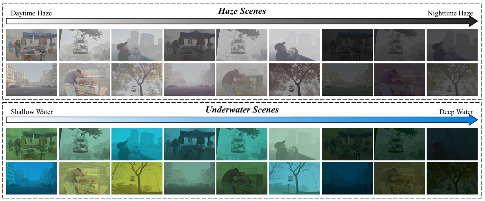
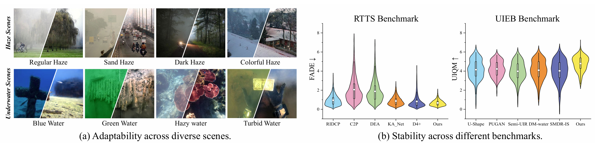

# <p align=center> Seeing through Scattering from Degradation Embedding to Peeling </p>

<p align=center>
<a href='https://index-yang.github.io/E2P'></a> &nbsp;&nbsp;&nbsp;
<a href='https://index-yang.github.io/E2P'></a> &nbsp;&nbsp;&nbsp;
<a href='https://huggingface.co/spaces/IndexYang/E2P-space'></a>
</p>


This is the official code for "Seeing through Scattering from Degradation Embedding to Peeling".

You can use our Huggingface Space to quickly test our method. If this project is helpful to you, please help star this repo and cite our paper. Thank you! 🙏


### :mega: Updates
- **2025.07.01**: Creat this repository.
- **2025.07.08**: Updates2.
<!-- ### :sparkles: Highlights: 
- SAID 
- E2P
- SOTA -->
### :page_facing_up: Todo-list
- [ ] Release the test set of SAID.
- [ ] Release test code and weights.
- [ ] Release full SAID dataset.
- [ ] Release train code.


## :rocket: SAID Dataset   
<!-- We will be made this dataset public as soon as possible! -->


<!-- <table align="center">
<thead>
<tr>
<th>Dataset</th>
<th>Number</th>
<th>Download link</th>
</tr>
</thead>
<tbody align="center">
<tr>
<td>SAID test set</td>
<td>3,200</td>
<td>[<a href="">Baidu Disk (TBD)</a>] [<a href="">Google Drive (TBD)</a>]</td>
</tr>
<tr>
<td>Full SAID dataset</td>
<td>32,976</td>
<td>[<a href="">Baidu Disk (TBD)</a>] [<a href="">Google Drive (TBD)</a>]</td>
</tr>
</tbody>
</table> -->
#### 1. If you are interested in SAID, you can download it from the links below.
| Dataset&#xA;           | Number&#xA; | Download link&#xA;                             |
| ---------------------- | ----------- | ---------------------------------------------- |
| SAID test set&#xA;     | 3,200&#xA;  | \[<a href="">Baidu Disk (TBD)</a>] \[<a href="">Google Drive (TBD)</a>]&#xA; |
| Full SAID dataset&#xA; | 32,976&#xA; | \[<a href="">Baidu Disk (TBD)</a>] \[<a href="">Google Drive (TBD)</a>]&#xA; |

#### 2. The dataset directory structure will be arranged as:
```
SAID
  |- clear
    |- 1.png
    |- ...
```

## :sparkles: Results
<!-- This is Results. -->

You will find more detailed results in our paper.


## :wrench: Dependencies and Installation
- CUDA = 11.7 (Only tested on this version)
- Both Windows and Linux can run this code
- Other required packages in requirements.txt
#### Step1. Create conda environment
```
# Clone this repo.
git clone https://github.com/index-yang/E2P
cd E2P

# Create conda env.
conda create -n E2P python=3.9
conda activate E2P
```
#### Step2. Install dependencies
```
# Install torch
pip install torch==1.13.0+cu117 torchvision==0.14.0+cu117 torchaudio==0.13.0 --extra-index-url https://download.pytorch.org/whl/cu117

# Install clip and other dependencies
pip install ftfy regex tqdm
pip install git+https://github.com/openai/CLIP.git
pip install scikit-image pandas einops thop

# If your NumPy version is 2.x, you need to uninstall it and install version 1.x
pip uninstall numpy
pip install numpy==1.23.5
```

    
## :runner: Quickly Test
<!-- ### Step1: Config Environment.
    Config. -->
#### Step1. Download weights.
    ckpts path.
#### Step2. Place your degraded images.
    Put.
#### Step3. Run and get clear image！
    Run.


## :computer: Train
<!-- ### Train the Degradation Embedding
### Train the Degradation Peeling Network -->
Please note that due to time, our training code is not fully sorted out yet, but it won't take long, so stay tuned.

## :book: BibTeX
    This is BibTeX

## :email: Contact
Should you have any question, please contact **Donghui Yang**! His email is yangdonghui@mail.dlut.edu.cn
