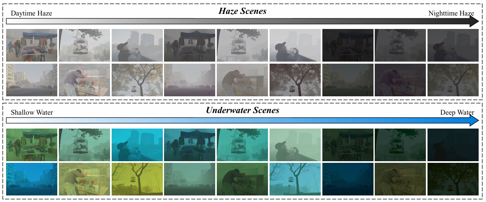
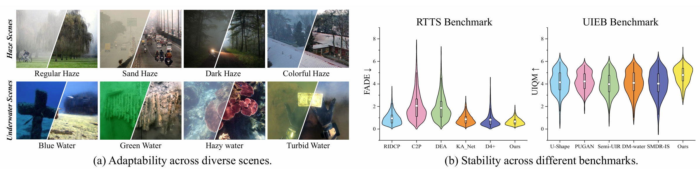

# <p align=center> Seeing through Scattering: Learning from Degradation  Embedding to Peeling and A Large-Scale Synthetic Dataset </p>

<!-- <p align=center>
<a href='https://index-yang.github.io/E2P'></a> &nbsp;&nbsp;&nbsp;
<a href='https://index-yang.github.io/E2P'></a> &nbsp;&nbsp;&nbsp;
<a href='https://huggingface.co/spaces/IndexYang/E2P-space'></a>
</p> -->

This is the official code for "Seeing through Scattering: Learning from Degradation  Embedding to Peeling and A Large-Scale Synthetic Dataset".

If this project is helpful to you, please help star this repo and cite our paper. Thank you! 🙏


### :mega: Updates
<!-- - **2025.07.01**: Creat this repository. -->
- **2026.04.01**: Release the test set of SaS.
- **2026.04.01**: Release full SaS dataset.
<!-- ### :sparkles: Highlights: 
- SaS
- E2P
- SOTA -->
### :page_facing_up: Todo-list
- [x] Release the test set of SaS.
- [x] Release full SaS dataset.
- [ ] Release test code and weights.
<!--- [ ] Release train code.-->

## :rocket: SaS Dataset   


#### 1. If you are interested in SaS, you can download it from the links below.
| Dataset&#xA;           | Number&#xA; | Download link&#xA;                             |
| ---------------------- | ----------- | ---------------------------------------------- |
| SaS test set&#xA;     | 3,200&#xA;  | \[<a href="https://pan.baidu.com/s/1jV_QsnYoPGt6cFzdSOpHeg?pwd=7iah">Baidu Disk (pwd:7iah)</a>] \[<a href="https://drive.google.com/file/d/1oxAkfGyE5woTCrpR8FCYsGFZ62In74Ra/view?usp=drive_link">Google Drive</a>]&#xA; |
| SaS train set&#xA; | 29,776&#xA; | \[<a href="https://pan.baidu.com/s/1rxK_tHTF0pUIr0QYYZyBqg?pwd=ta2m">Baidu Disk (pwd:ta2m)</a>] \[<a href="https://drive.google.com/file/d/1aRREOVAJPpA10iyetpLmBCE1T9zUp9wT/view?usp=drive_link">Google Drive</a>]&#xA; |

#### 2. The dataset directory structure will be arranged as:
The depth maps in the `depth-img` directory were generated by Depth Anything V2 and were used to synthesize the SaS.
<!-- ```
SaS
  |- clear
    |- 1.png
    |- ...
``` -->
```
└─SaS (SaS test set)
    ├─depth-img
    │   ├─0025.jpg
    │   └─...
    ├─clear
    │   ├─0025.jpg
    │   └─...
    ├─color
    │   ├─0025.jpg
    │   └─...
    ├─haze
    │   ├─0025.jpg
    │   └─...
    ├─other degradations...
    │   ├─0025.jpg
    │   └─...
```

## :sparkles: Results
<!-- This is Results. -->

You will find more detailed results in our paper.


## :wrench: Dependencies and Installation
- CUDA = 11.7 (Only tested on this version)
- Both Windows and Linux can run this code
- Other required packages in requirements.txt
#### Step1. Create conda environment
```
# Clone this repo.
git clone https://github.com/index-yang/E2P
cd E2P

# Create conda env.
conda create -n E2P python=3.9
conda activate E2P
```
#### Step2. Install dependencies
```
# Install torch
pip install torch==1.13.0+cu117 torchvision==0.14.0+cu117 torchaudio==0.13.0 --extra-index-url https://download.pytorch.org/whl/cu117

# Install clip and other dependencies
pip install ftfy regex tqdm
pip install git+https://github.com/openai/CLIP.git
pip install scikit-image pandas einops thop

# If your NumPy version is 2.x, you need to uninstall it and install version 1.x
pip uninstall numpy
pip install numpy==1.23.5
```

    
## :runner: Quickly Test
<!-- ### Step1: Config Environment.
    Config. -->
#### Step1. Download and place weights.
All pre-trained weights can be downloaded: 
<a href="https://pan.baidu.com/s/1rBY8HN1T0_n1Z5rXo0KIHw?pwd=kaq9">Baidu Disk (pwd:kaq9)</a>] \[<a href="">Google Drive (TBD)</a>]

Then place the files into the correct directories:
- `E2P_model.tar` → `ckpts`
- `model_iter_12000_klrate.pth` and  `prompt_iter_12000_klrate.pth` → `prompt-ckpt`
- `ViT-B-32.pt` → `clip_model`


#### Step2. Place your degraded images.
Put your degraded image to `input` directory.
#### Step3. Run and get clear image！
You can run this project with the command `python test-E2P.py`.
The restored clear images will be stored in the `output` folder.

<!--
## :computer: Train
### Train the Degradation Embedding
### Train the Degradation Peeling Network 
Please note that due to time, our training code is not fully sorted out yet, but it won't take long, so stay tuned.-->

## :book: BibTeX
    This is BibTeX

## :email: Contact
Should you have any questions, please contact **Donghui Yang** via email: yangdonghui@mail.dlut.edu.cn.
Alternatively, you may reach the corresponding author **Long Ma** at: malone94319@gmail.com.